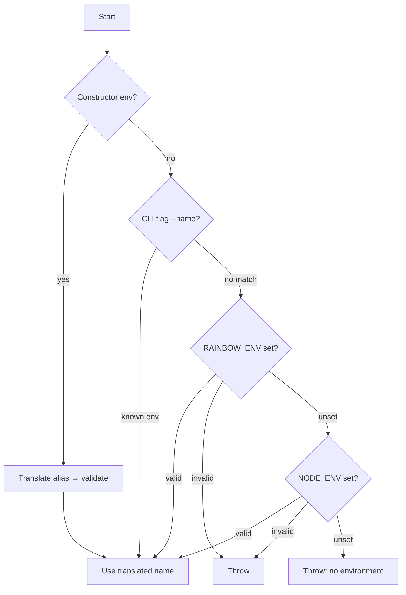

# Rainbow Config

**YAML configuration for Node.js — environment-aware, typed getters, and secret substitution.**

[](https://www.npmjs.com/package/@rainbow-industries/rainbow-config)
[](https://www.typescriptlang.org/)
[](https://nodejs.org/api/esm.html)

---

## Table of contents

- [Features](#features)
- [Installation](#installation)
- [Quick start](#quick-start)
- [Project layout](#project-layout)
- [Environments](#environments)
- [Secrets](#secrets)
- [API reference](#api-reference)
- [TypeScript](#typescript)
- [Errors](#errors)
- [Changelog](#changelog)

---

## Features

- Load per-environment YAML files from a configurable directory
- Resolve `${SECRET_KEY}` placeholders from environment variables or a secrets file
- Built-in environments with short aliases (`dev`, `test`, `int`, `prod`)
- Dot-path access (`db.main.port`) with optional typed getters
- Full TypeScript types and ESM-first design

---

## Installation

```bash
npm install @rainbow-industries/rainbow-config
```

---

## Quick start

**`config/development.yml`**

```yaml
db:
  main:
    port: 5432
    host: ${db_host}
    password: ${DB_PASSWORD}
myKey: myValue
anArray:
  - itemOne
  - itemTwo
```

**`secrets.development.yml`** (at project root, or a custom secrets directory)

```yaml
db_host: db.example.com
DB_PASSWORD: soSecureICantBelieveIt
```

**`app.ts`**

```typescript
import RainbowConfig from '@rainbow-industries/rainbow-config';
import path from 'path';
import { fileURLToPath } from 'url';

const __dirname = path.dirname(fileURLToPath(import.meta.url));
const rootDir = path.join(__dirname, '..');

const config = new RainbowConfig();

await config.load(rootDir);

console.log(config.getEnvironment());           // development
console.log(config.get<number>('db.main.port')); // 5432
console.log(config.getString('db.main.password')); // soSecureICantBelieveIt
```

---

## Project layout

By default, Rainbow Config expects this structure relative to the `rootPath` you pass to `load()`:

```
your-project/
├── config/
│   ├── development.yml
│   ├── testing.yml
│   ├── integration.yml
│   └── production.yml
├── secrets.development.yml    # optional; see Secrets
├── secrets.testing.yml
└── src/
    └── app.ts
```

| File | Location | Purpose |
|------|----------|---------|
| Environment config | `{rootPath}/{configDir}/{environment}.yml` | Main YAML config (default `configDir` is `config`) |
| Secrets | `{rootPath or secretsDir}/secrets.{environment}.yml` | Fallback values for `${...}` placeholders |

Change the config directory with `setConfigDir()` before calling `load()`.

---

## Environments

Rainbow Config picks **one** environment file: `config/{environment}.yml`.

### Built-in environments

| Canonical name | Aliases |
|----------------|---------|
| `development` | `dev` |
| `testing` | `test` |
| `integration` | `int` |
| `production` | `prod` |

Register more with `addEnvironment('staging', 'stg')`.

### How the environment is chosen

Detection runs in this order (first match wins):



1. **Constructor** — `new RainbowConfig('dev')` (aliases are translated)
2. **Command line** — any `process.argv` entry after stripping `--`, e.g. `--development` or `--prod`
3. **`RAINBOW_ENV`** — environment variable (preferred over `NODE_ENV`)
4. **`NODE_ENV`** — standard Node environment variable

If none of the above yields a registered environment name, `load()` throws.

---

## Secrets

Placeholders in YAML must be a **single string value** matching:

```text
${key_name}
```

Rules for `key_name`:

- Starts with a lowercase letter
- Contains only lowercase letters, digits, and underscores (`a`–`z`, `0`–`9`, `_`)

Examples: `${db_host}`, `${DB_PASSWORD}` ✓ — `${DbHost}` or `${my-secret}` ✗

### Resolution order

For each placeholder, the value is resolved in order:

1. **`process.env[key_name]`** — if set, that value is used
2. **`secrets.{environment}.yml`** — otherwise the key must exist in the secrets file

Secrets file values must be a **string**, **number**, or **boolean**. Other types throw when the file is loaded.

### Secrets file location

- Default: `{rootPath}/secrets.{environment}.yml`
- Custom: pass a second argument to `load(rootPath, secretsDir)` to load `secrets.{environment}.yml` from another directory

The secrets file is read once per `load()` and cached in memory.

---

## API reference

### Import

```typescript
import RainbowConfig from '@rainbow-industries/rainbow-config';
import type { RainbowConfigType } from '@rainbow-industries/rainbow-config';
```

---

### `new RainbowConfig(env?: string)`

Creates a config loader. Optionally pin the environment in the constructor; otherwise detection runs at `load()` time.

```typescript
const config = new RainbowConfig();
const pinned = new RainbowConfig('dev'); // loads config/development.yml
```

| Parameter | Type | Description |
|-----------|------|-------------|
| `env` | `string` (optional) | Environment name or alias (`dev` → `development`) |

---

### `setConfigDir(configDir: string): void`

Sets the directory name under `rootPath` where YAML files live. Default: `'config'`.

Must be called **before** `load()`.

```typescript
config.setConfigDir('conf');
// → conf/development.yml
```

---

### `addEnvironment(name: string, alternativeName?: string): void`

Registers a custom environment and an optional CLI/env alias.

Must be called **before** `load()`.

```typescript
config.addEnvironment('staging');
config.addEnvironment('staging', 'stg');
// --stg or RAINBOW_ENV=stg → staging
```

---

### `load(rootPath: string, secretsDir?: string): Promise<void>`

Loads and parses the environment YAML file, substitutes secrets, and marks the instance ready for reads.

```typescript
await config.load('/path/to/project');
await config.load('/path/to/project', '/path/to/secrets-only-dir');
```

| Parameter | Type | Description |
|-----------|------|-------------|
| `rootPath` | `string` | Base directory containing the config folder (and default secrets file) |
| `secretsDir` | `string` (optional) | Directory containing `secrets.{environment}.yml` instead of `rootPath` |

**Throws** if the config file is missing, unreadable, invalid YAML, environment cannot be determined, or a secret cannot be resolved.

---

### `getEnvironment(): string`

Returns the resolved canonical environment name (e.g. `development`).

Requires `load()` to have completed.

```typescript
const env = config.getEnvironment();
```

---

### `getTranslatedEnvironment(env: string): string`

Maps a known alias to its canonical name; returns `env` unchanged if no alias exists. Does not require `load()`.

```typescript
config.getTranslatedEnvironment('dev');  // 'development'
config.getTranslatedEnvironment('prod'); // 'production'
```

---

### `get<T>(key?: string): T`

Returns the full config object or a nested value by dot-separated path.

Requires `load()` to have completed.

```typescript
const all = config.get();                    // entire parsed config
const db = config.get<{ main: { port: number } }>('db');
const port = config.get<number>('db.main.port');
```

| Parameter | Type | Description |
|-----------|------|-------------|
| `key` | `string` (optional) | Dot path, e.g. `'db.main.password'` |

**Throws** if the path does not exist.

---

### `getOptional<T>(key?: string): T | undefined`

Same as `get()`, but returns `undefined` when the path is missing instead of throwing.

```typescript
const maybe = config.getOptional<string>('feature.flag');
```

---

### `has(key: string): boolean`

Returns whether a dot path exists in the loaded config.

```typescript
if (config.has('db.main.port')) { /* ... */ }
```

---

### Typed primitive getters

Strict helpers that require the value to exist and match the expected JavaScript type.

| Method | Returns | Throws when |
|--------|---------|-------------|
| `getString(key)` | `string` | Missing key or wrong type |
| `getNumber(key)` | `number` | Missing key or wrong type |
| `getBoolean(key)` | `boolean` | Missing key or wrong type |
| `getOptionalString(key)` | `string \| undefined` | Wrong type (missing → `undefined`) |
| `getOptionalNumber(key)` | `number \| undefined` | Wrong type (missing → `undefined`) |
| `getOptionalBoolean(key)` | `boolean \| undefined` | Wrong type (missing → `undefined`) |

```typescript
const password = config.getString('db.main.password');
const port = config.getNumber('db.main.port');
const enabled = config.getBoolean('test');

const optionalFlag = config.getOptionalString('feature.flag');
```

Type mismatch errors include the actual type (`array`, `null`, etc.) in the message.

---

## TypeScript

The package ships with declaration files. Use generics on `get` / `getOptional` for nested shapes, or primitive getters when you want runtime type checks:

```typescript
interface DbConfig {
  main: {
    port: number;
    host: string;
    password: string;
  };
}

const config = new RainbowConfig('development');
await config.load(rootDir);

const db = config.get<DbConfig>('db');
const port: number = config.getNumber('db.main.port');
```

Export type for dependency injection or wrappers:

```typescript
import type { RainbowConfigType } from '@rainbow-industries/rainbow-config';

function createApp(cfg: RainbowConfigType) { /* ... */ }
```

---

## Errors

Common failure modes:

| Situation | Typical error |
|-----------|----------------|
| `get()` / `has()` before `load()` | `Please call the load() method on the RainbowConfig first!` |
| `setConfigDir()` / `addEnvironment()` after `load()` | `Cannot set the config dir...` / `Cannot add an environment...` |
| Missing config file | `Failed to load the configuration: Failed to load the file ...` |
| Unknown `RAINBOW_ENV` / `NODE_ENV` | `Unknown environment '...'` |
| No environment detected | `Failed to determine the environment...` |
| Invalid constructor env | `The environment ... is not a valid environment!` |
| Missing config path | `section ... does not exist!` |
| Unresolved secret | `Failed to load secret ... neither provided as environment variable nor set in the secrets file` |
| Invalid secret file value | `Secrets in file ... need to be a string, bool or number!` |
| Wrong type in getter | `expected string but received number!` |

---

## Changelog

### Version 3.x

- **`load(path)`** — the config root path is passed to `load()`, not the constructor
- **TypeScript** — rewritten in TypeScript with exported types
- **New API** — `getOptional`, typed getters (`getString`, `getNumber`, …), `has`, `getEnvironment`, `getTranslatedEnvironment`
- **JavaScript** — still usable from plain JS with the same ESM import

Earlier 2.x docs that referenced `@rainbow-config/RainbowConfig` or constructor-based paths are obsolete; use `@rainbow-industries/rainbow-config` and `load(rootPath)` as shown above.

---

## License

See repository license terms for `@rainbow-industries/rainbow-config`.
